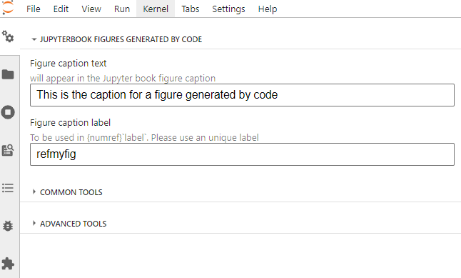

# Figure captions in Jupyter book for figures generated by code

In  Jupyter book, captions can be given for figures generated by code. This extension enables a quick way to enter those captions.



## Installation instructions


This jupyterlab extension  can be installed using pip:
```
pip install Jupyterbook_code_caption
```

if you want to install it locally (for development):

```
pip install -e .
```
